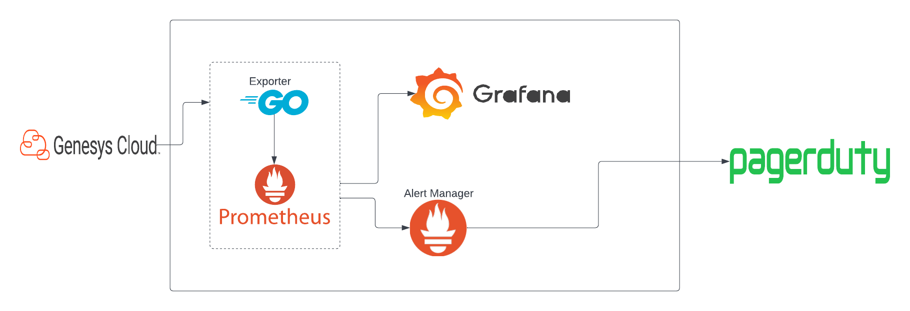

:::{"alert":"primary","title":"About Genesys Cloud Blueprints","autoCollapse":false} 
Genesys Cloud blueprints were built to help you jump-start building an application or integrating with a third-party partner. 
Blueprints are meant to outline how to build and deploy your solutions, not a production-ready turn-key solution.
 
For more details on Genesys Cloud blueprint support and practices 
please see our Genesys Cloud blueprint [FAQ](https://developer.genesys.cloud/blueprints/faq)sheet.
:::

This Genesys Cloud Developer Blueprint demonstrates how to set up Prometheus, Alert Manager and Grafana to keep track of MOS scores of conversations in your organization. The blueprint also demonstrates how to write an exporter(in golang) that grabs conversation data from genesys' analytics api and update required metrics.

This blueprint demonstrates how to:

- Write a promethues exporter in golang
- Configure prometheus and the Alert Manager.
- Configure Alert Manager to send to notifications to PagerDuty
- Set up the infrastructure with docker-compose

**Note**: This blueprint demonstrates how to run prometheus and associated software both locally and using docker compose. If you prefer to utilize docker, you can skip to the [ docker compose](#run-with-docker-compose) section.



## Contents

- [Solution components](#solution-components "Goes to the Solutions components section")
- [Prerequisites](#prerequisites "Goes to the Prerequisites section")
- [Implementation steps](#implementation-steps "Goes to the Implementation steps section")
- [Additional resources](#additional-resources "Goes to the Additional resources section")

## Solution components

- **[Genesys Cloud](https://www.genesys.com/genesys-cloud "Opens the Genesys Cloud website")** - A suite of Genesys cloud services for enterprise-grade communications, collaboration, and contact center management. You create and manage OAuth clients in Genesys Cloud.
- **[Prometheus](https://prometheus.io/ "Opens prometheus website")** - A free software application used for event monitoring and alerting.
- **[Pager Duty](https://www.pagerduty.com/ "Opens pagerDuty website")** - A SaaS incident response platform.
- **[Golang](https://go.dev/ "Opens golang website")** - A statically typed, compiled programming language designed by Google.
- **[Docker](https://www.docker.com/ "Opens docker website")** - A set of platform as a service (PaaS) products that use OS-level virtualization to deliver software in packages called containers.
- **[Grafana](https://grafana.com/oss/grafana/ "Opens Grafana website")** - A multi-platform open source analytics and interactive visualization web application.
- **[Alert Manager](https://github.com/prometheus/alertmanager "Opens pagerDuty website")** - The Alertmanager handles alerts sent by client applications such as the Prometheus server.

## Prerequisites

### Specialized knowledge

- Experience with golang
- Experience with Prometheus
- Experience with PagerDuty integration
- Experience with Docker

### Genesys Cloud account requirements

- A Genesys Cloud license. For more information, see [Genesys Cloud Pricing](https://www.genesys.com/pricing "Opens the Genesys Cloud pricing page") in the Genesys website.
- Master Admin role. For more information, see [Roles and permissions overview](https://help.mypurecloud.com/?p=24360 "Opens the Roles and permissions overview article") in the Genesys Cloud Resource Center.

### PagerDuty Account

- A Manager base role or higher is required. For more information about user roles, see [User roles](https://support.pagerduty.com/docs/user-roles#section-checking-your-user-role "Opens The shared config and credentials files") in pagerDuty documentation.

### Third-party software

- Golang version go1.16.13 or later. For more information, see [go](https://go.dev/dl/ "Opens golang download website") on the golang website.
- Prometheus. For more information, see [download prometheus](https://prometheus.io/download/) on the prometheus website
- Grafana version 8.4.3 or later. For more information, see [download grafana](https://grafana.com/grafana/download) on the grafana website
- Docker Desktop. For more information, see [download docker](https://www.docker.com/products/docker-desktop) on the docker website
- Alert Manager 0.23.0 or later. For more information see [alert manager](https://github.com/prometheus/alertmanager) repo on github

## Implementation steps

- [Clone the repository that contains the project files](#clone-the-repository-that-contains-the-project-files "Goes to the Clone the repository containing the project files section")
- [Download and extract Prometheus and the Alert Manager](#download-and-extract-prometheus-and-the-alert-manager "Download and extract prometheus and the alert manager section")
- [Get PagerDuty integration key](#get-pagerduty-integration-key "Goes to the get pagerduty intgration key section")
- [Configure Prometheus](#configure-prometheus "Goes to the configure promethues section")
- [Configure Alert Manager](#configure-alert-manager "Goes to the configure alert manager section")
- [Run Grafana](#run-grafana "Goes to the grafan section")
- [Define the environment variables](#define-the-environment-variables "Define the environment variables section")
- [Run locally](#run-locally "Goes to the run locally section")
- [Run With Docker Compose](#run-with-docker-compose "Goes to the docker section")
- [View dashboard](#view-dashboard "Goes to the Create a trigger to call workflow on call disconnect section")

### Clone the repository that contains the project files

Clone the [conversation-MOS-score-dashboard-blueprint](https://github.com/GenesysCloudBlueprints/conversation-mos-score-dashboard-blueprint "Opens the conversation-MOS-score-dashboard-blueprint") repository from GitHub to your local environment's configuration.

### Download and extract Prometheus, Grafana and the Alert manager

- [Download](https://prometheus.io/download/) the zip files of Prometheus and Alert Manager based on your environment

- [Download](https://grafana.com/grafana/download?pg=get&platform=linux&plcmt=selfmanaged-box1-cta1) grafana based on your environment

### Get PagerDuty integration key

Follow the steps [here](https://www.pagerduty.com/docs/guides/prometheus-integration-guide/) to aquire your integration key. Take note of the integration key becuause it will be used in later.

### Configure Prometheus

1. After downloading and extracting promethues, copy the content of the **prometheus.yml** file in the cloned blueprint repo and paste it in the `prometheus.yml` file located in the extracted prometheus directory.

2. After pasting the new config, change the target of the `genesys` job to `localhost:2113`. like this:

```yaml
- job_name: genesys
  static_configs:
    - targets: ["localhost:2113"]
```

3. Copy the alert-rules.yml config file from the cloned blueprint repo and paste it in the extracted promethues directory

### Configure Alert Manager

1. After extracting the downloaded alert manager, replace the content of the `alertmanager.yml` with the content of the `alertmanager.yml` found in the blueprint's repo.

2. Modify the value of `service_key` under `pagerduty_configs` with the integration key you got from [PagerDuty integration](#get-pagerduty-integration-key "Goes to the get pagerduty intgration key section") section.

```yaml
- name: "pager-duty"
  pagerduty_configs:
    - service_key: "<YOUR INTEGRATION KEY GOES HERE>"
```

### Run Grafana

It is recommneded to use docker to run grafana but you can also run it locally. Refer the [documentation](https://grafana.com/docs/grafana/latest/) to see how to run your grafana version.

### Define the environment variables

Declare the following variables in your environment:

- **GENESYSCLOUD_OAUTHCLIENT_ID**: This is the Genesys Cloud client credential grant id that would be used for authentication.
- **GENESYSCLOUD_OAUTHCLIENT_SECRET**: This is the Genesys Cloud client credential secret that would be used for authentication.
- **GENESYSCLOUD_REGION**: This is the region in which your organization is located. i.e. mypurecloud.com

### Run locally

1. Open a terminal window and set the working directory to the extracted promethues directory. Then run the following:

```bash
./prometheus --config.file=prometheus.yml
```

2. Open another terminal window and set the working directory to the extrated promethues directory. Then run the following:

```bash
./alertmanager --config.file=alertmanager.yml
```

3. Now open a terminal window and set the working directory to the `exporter` directory located in the cloned blueprint repo. Then run the following:

```bash
go run main.go
```

### Run With Docker Compose

- Open a terminal window and set the working directory to `src/exporter/` located in the blueprint's repo
- Run the command below:

```bash
docker build -t genesys_exporter .
```

- Configure Alert Manager by adding your PagerDuty integration key to the `alertmanager.yml` located in the alertmanager directory. Refer to the [get PagerDuty integration key](#get-pagerduty-integration-key "Goes to the get pagerduty intgration key section") section and step two in [configure Alert Manager](#configure-alert-manager "Goes to the configure alert manager section") section.
- Open a terminal window and set working directory to `src`
- Run the commnd below:

```bash
docker-compose up
```

**Note**: Make sure you have no processes running in ports 3000, 9090,9093, and 2113 because those ports will be utilized by the docker containers.

### View Dashboard

Open your browser and navigate to http://localhost:9090. If everything worked correctly, you'll see a prometheus instance running. To view the metrics collected by the exporter, you can search for `genesys_mos_score` in the search bar. Prometheus provides a myriad ways to query your metrics data. More about that can be found here: [querying prometheus](https://prometheus.io/docs/prometheus/latest/querying/basics/).

For a better UI experience, open http://localhost:3000 where Grafana will be located. You will be asked for a user name and password, the default is `admin` for both but you change that after you login. After logging, you can easily create a dashboard to track any preferred metric(s).

You can also modify the configuration of the alert manager. It's currently set to send events to pagerduty when a conversation's mos_score is below `4.86`. You can set that number to any desirable value(must be below 5.0). This configuration can be found in the `alertmanager.yml` file.

## Additional resources

- [Instrumenting a go application for prometheus](https://prometheus.io/docs/guides/go-application/) in prometheus docs
- [Writing exporters for prometheus](https://prometheus.io/docs/instrumenting/writing_exporters/) in prometheus docs
- [Prometheus Alerting rules](https://prometheus.io/docs/prometheus/latest/configuration/alerting_rules/) in promethus docs
- [Integrating prometheus with pagerDuty](https://www.pagerduty.com/docs/guides/prometheus-integration-guide/) on pagerDuty website
- [conversation-MOS-score-dashboard-blueprint](https://github.com/GenesysCloudBlueprints/conversation-mos-score-dashboard-blueprint) on Github
